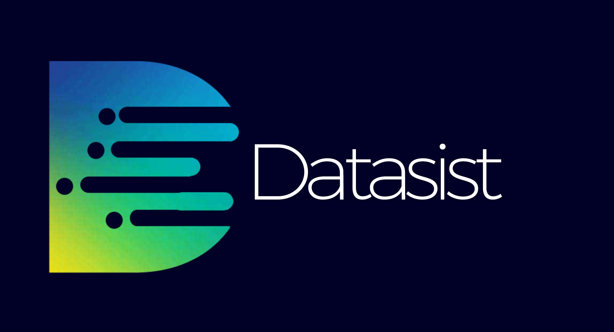

# Get Started

Datasist is not a drop down replacement for popular data science  libraries like Pandas, Matplotlib or Seaborn, but serve as an abstraction with the goal of unifying processes and functions for efficient data analysis and management. 

Check out our [Github](https://github.com/risenW/datasist) repository and give us a **star** if you like this project.

Contribute to Datasist on [Github](https://github.com/risenW/datasist) or help us improve this [documentation](https://github.com/risenW/datasist-doc)

Follow us on [Twitter](https://twitter.com/datasistlibrary) to get updates, tips and major announcements.

Send us an Email **datasistlibrary@gmail.com**

